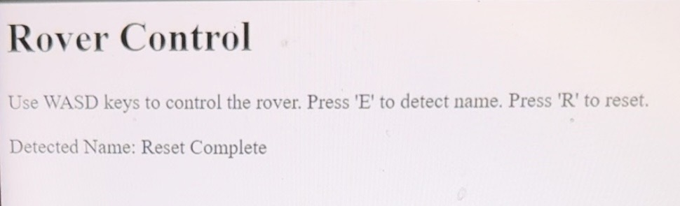

# ELEC40006--Electronics-Design-Project-1-2023-2024-Group-6-Software-codes
This repository includes all the programmes we designed throughout the project.

Within this project, we need to design several parts for a functional rover that can accurately classify the lizard and its name, so we can split this task into the motor control part and the other 4 sensor parts.
# Rover Control
Rover_control files are the programs that combine the rover's remote control and the sensor features.

Rover_control_v1 includes the four directions controlled by the 'W', 'A', 'S', and 'D' keys and the Ultrasound name detection feature with 'E' to detect and 'R' to refresh.

