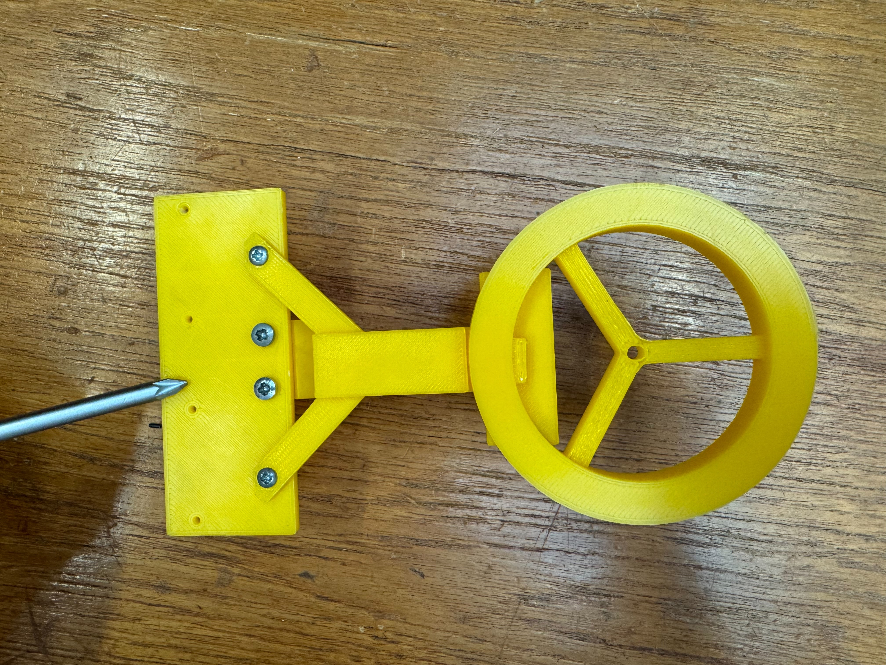
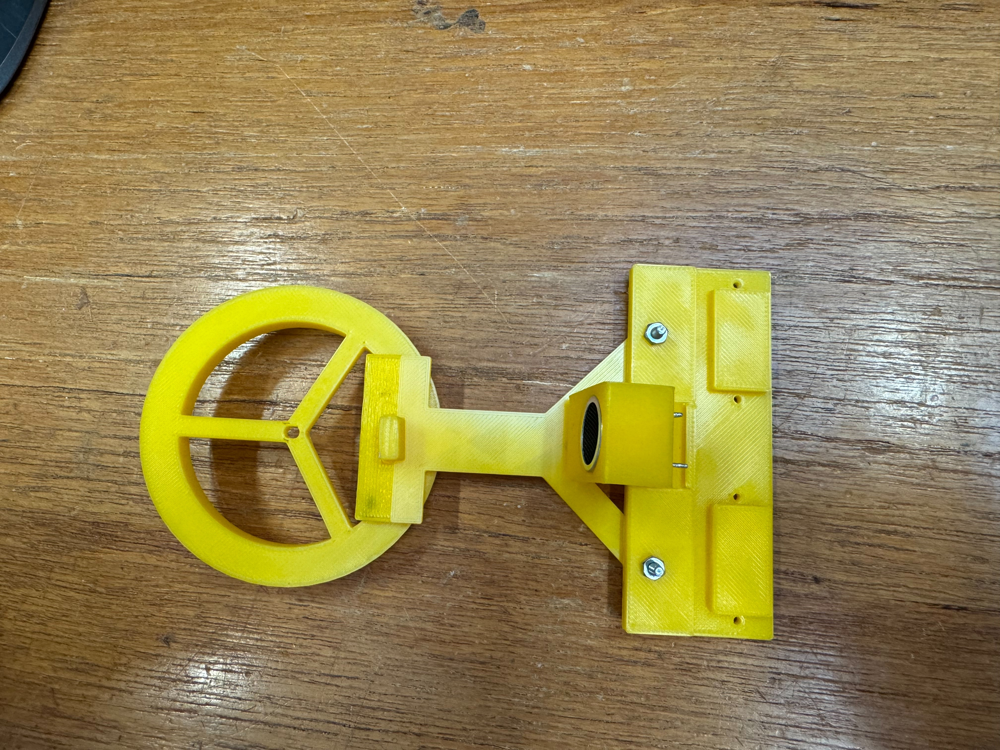

# This folder contains the teh 3D designs for the sensor module

The sensor module is a system-level design that integrates all the sensor subsystems together aiming for an efficient scanning of the lizard.
The sensor holder is customized according to the lizard which the rover is meant to collect information from. 

Based on the measurement of the lizard and the signal sources, we made the Sensor_holder_v1.stl

Sensor_holder_v1.stl has major problems with the hall sensor holder(too thin), and the ultrasound sensor does not fit properly.

Sensor_holder_v2.stl is not optimized for 3D printing, the professor suggested we print the holder by part and then assemble them.

Sensor_holder_v3 folder contains all the files for the holder
The following are the photos of the assembled sensor holder

{style="transform: rotate(90deg);"}

