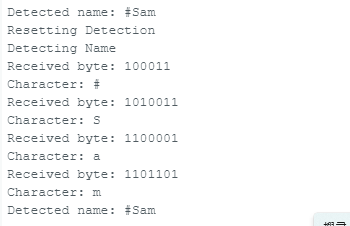

# This folder is dedicated to the code used for detecting ultrasound signals
decode_v1 utilizes our algorithm to decode the ultrasound signal. which is unstable and inefficient.

decode_v1.5 utilizes the RX pin input to decode the UART packets, and then finds the starting character of the name '#' and prints out the full name

